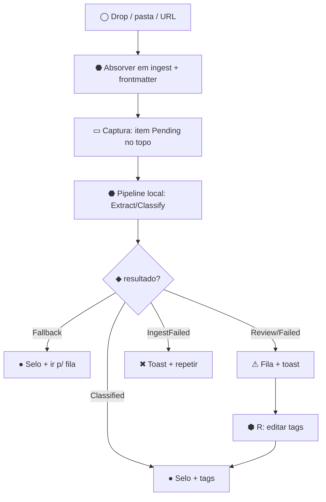
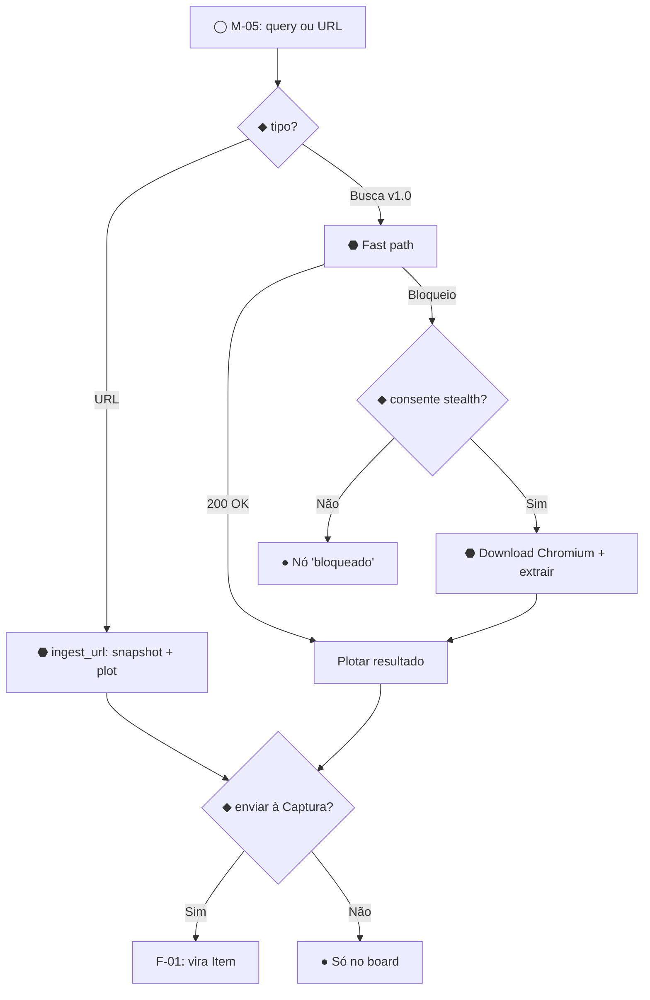
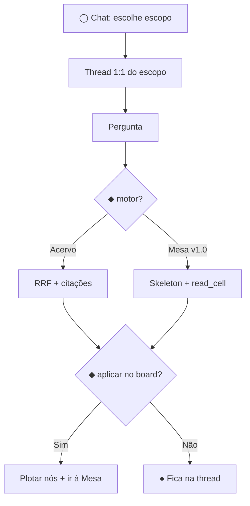
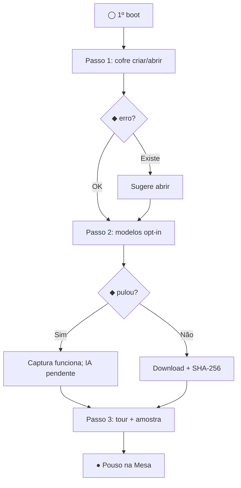

# Arquitetura da Informação — Sandland

**Fase:** 2 de 5 (IA) · **Status:** Aprovado para derivação da Fase 3 (Wireframes)
**Data:** 2026-09-22 · **Arquivo:** `docs/ux/ia.md`
**Insumo:** `docs/ux/fundamentos.md` (Fase 1) — decisões D-01–D-09 e princípios P1–P8 valem aqui.
Nada neste documento pode violá-los sem emenda na Fase 1.

---

## 0. Decisões novas desta fase (D-10–D-23, vinculantes)

| # | Decisão | Resolve | Racional (1 linha) |
|---|---------|---------|-------------------|
| D-10 | Shell persistente único: switcher de 3 ecrãs + nome real do cofre + badge de provedor + sino + engrenagem | G-02, X-01, P1 | Wayfinding global; soberania sempre visível; sino dá casa ao progresso de modelo |
| D-11 | Intenções = aba dentro do Chat (configurar meta/hipótese/tags) + alertas quietos no X-01 | Q-01 | Intenção é escopo de conversa e fonte de alerta — não merece 4º ecrã (D-01) |
| D-12 | Chat tem seletor de escopo: **Acervo / Mesa ativa / Intenção**; padrão = último usado | Q-02 | Dualidade de motores exige escopo explícito; sem ele, citação é impossível (P3) |
| D-13 | Busca plena mora na Captura; na Mesa, busca = palette (nós do board + ações). Sem 4ª busca | Q-03 | Search não substitui IA; dois escopos, dois lugares, zero ambiguidade |
| D-14 | `scratchpad/` ganha surface: captura rápida (atalho global) → célula volátil no board ativo, já em edição | Q-04 | Rascunho precisa de porta de entrada em qualquer ecrã; destino é sempre a Mesa (P5) |
| D-15 | Troca de vault: dropdown compacto no shell + gestão plena em Config; onboarding S-00 em 3 passos (cofre → modelos opt-in → tour), pouso na Mesa | Q-07 | G-02 fix; B3/T028.1 exigem opt-in antes do LLM; pular é seguro (fallback) |
| D-16 | Gestão de taxonomia = secção da Captura (termos, frequência, fundir/renomear) | Q-08 | FR-005/007 + SC-003 (80%) exigem surface; vocabulário nasce na Captura |
| D-17 | Revisão = filtro persistente "A rever (N)" + atalho `R`; sem view dedicada nesta rodada | Q-11 | Fila é estado, não lugar; view dedicada só se a fila provar ser grande (medir) |
| D-18 | Chat antecipado: **Acervo na v0.2** (RRF pronto, T046); escopo Mesa + Intenções na v1.0 (RLM/Skeleton, roadmap) | C-04 | Antecipação legítima sem violar roadmap; matriz §4 trava o resto |
| D-19 | Palette é **global** (todos os ecrãs) para navegação/ações; **ações de IA só habilitadas na Mesa**; nasce v0.1 sem IA | D-03 + recomendação Fase 1 | Preserva P2 (sem IA na Captura) e dá captura rápida + navegação por teclado desde já |
| D-20 | Preservação de estado entre ecrãs: viewport por workspace (persistido), filtro/scroll da Captura (sessão), thread por escopo no Chat (persistido, B-02), query da palette (efêmera) | Wayfinding | Trocar de ecrã nunca perde trabalho nem posição |
| D-21 | Chat: **uma thread por escopo** (Acervo · Mesa:`id` · Intenção:`id`); trocar escopo troca thread; lista de histórico adiada p/ v1.0 | Q-02 detalhe | Isolamento 1:1 (P2); sem lista, sem gestão de histórico na v0.2 |
| D-22 | Ação de IA com provedor indisponível (sem modelo local e sem chave) aparece **desabilitada com CTA "Configurar"** — nunca some, nunca falha em silêncio | ADR-0002 | Descobribilidade + P1: o usuário aprende o que falta, onde resolver |
| D-23 | Widget web em 2 estágios: v0.1 = capturar URL → snapshot → plotar (`ingest_url` existe); v1.0 = busca SERP plena | D-06 | `ingest_url` v0.1 é suficiente p/ o gesto plotar→ingerir; SERP é roadmap v1.0 |

> Q-05 (UI de undo), Q-09 (geometria da Peça) e Q-10 (nomes `topology.json`×`board.canvas.json`)
> seguem abertos com dono na §10. Q-06 (central de notificações) é resolvido na §7 desta fase.

---

## 1. Shell global (D-10)

Um único chrome persistente, idêntico nos 3 ecrãs + Config (consistência absoluta =
orientação; skill `navigation-patterns`: navegação nunca muda de lugar).

```
┌────────────────────────────────────────────────────────────────────────────┐
│ [S] SANDLAND │ Captura │ Mesa │ Chat │ ▾ Cofre Real ▾ │ … │ [Local✓] [🔔¹] [⚙] │
└────────────────────────────────────────────────────────────────────────────┘
```

| Zona do shell | Conteúdo | Regra |
|---|---|---|
| Marca `[S] SANDLAND` | Logo + nome; clica → Mesa (casa) | Casa = Mesa: a promessa do produto é espacial |
| Switcher (navegação global) | 3 itens: Captura · Mesa · Chat | Estado ativo por peso + barra indicadora (nunca só cor); badge de contagem só na Captura = `N a rever` (D-17); atalhos `Ctrl/Cmd+1/2/3` |
| Seletor de cofre `▾ Nome Real ▾` | Dropdown: cofres recentes + "Abrir outro…" + "Criar…" (→ F-08); gestão plena em Config | Fixa G-02: nome vem de `VaultInfoDTO`, nunca hardcoded |
| Badge de provedor `[Local✓]` / `[Nuvem]` | Provedor ativo p/ Mesa+Chat; na Captura vira chip estático "100% local" (P1, FR-003) | P1: soberania visível em todo ecrã; clique → Config › Modelos |
| Sino `[🔔¹]` | X-01: badge = não-lidos (progresso, alertas, erros); clica → central (§7) | Toasts nunca roubam foco; central persiste na sessão |
| Engrenagem `[⚙]` | Configurações (S-04); contém Governança (D-07) | Utilitário separado do primário (skill: utility ≠ primary) |

**Regras do shell:** nenhuma ação de conteúdo no shell (só navegação/estado/sistema);
drop global de arquivos funciona em qualquer ecrã e roteia p/ Captura + toast "ver"
(FR-001, §7.1 fundamentos); janela mínima 960px — abaixo de 1200px, inspetor da Captura
vira overlay (regra estrutural; desenho na Fase 3).

---

## 2. Árvore de navegação + sitemap

Profundidade máxima 3 (heurística IA: raso > largo). Notação: `E` ecrã · `Z` zona ·
`O` overlay · `W` widget · `§` secção. IDs herdados da Fase 1.

```
Sandland (shell D-10)
├── S-00 Onboarding [T, 1ª execução] — cofre → modelos opt-in → tour → pouso na Mesa
├── S-01 Captura [E]
│   ├── Z-C1 Contexto: contagens, busca plena (RRF), filtro "A rever (N)" [R], origem
│   ├── Z-C2 Entrada: dropzone + capturar URL + feedback
│   ├── Z-C3 Lista: 3 densidades (P7); seleção → Z-C4 (X-06)
│   ├── Z-C4 Inspetor: detalhe do item, resumo, tags editáveis, "Enviar à Mesa", "Reprocessar"
│   └── Z-C5 Taxonomia: termos, frequência, fundir/renomear (D-16)
├── S-02 Mesa [E]
│   ├── Z-M1 Pílulas de workspaces (= M-04 fund.) [v0.2; v0.1 = título estático do board]
│   ├── Z-M2 Viewport canvas (pan/zoom/LOD 0.6/0.3 — lei)
│   ├── Z-M3 Controles de câmera + presets [+ minimapa v0.2 — G-12]
│   ├── M-02 Editor de célula (overlay; Esc descarta — G-06) [v0.1]
│   ├── M-08 Captura rápida: `N` global → célula volátil em edição no board ativo [D-14]
│   ├── M-05 Widget busca web [v0.1 URL→plot; v1.0 SERP — D-23]
│   ├── M-06 Peça [v0.2]: nó → expandida na Mesa (D-05; geometria Fase 3/Q-09)
│   ├── M-07 Contexto (nó/aresta/fundo): Promover, Enviar ao Chat, Excluir, Duplicar-view*
│   └── M-01 Palette [O global; IA só na Mesa — D-19] → §6
├── S-03 Chat [E; v0.2 Acervo, v1.0 pleno — D-18]
│   ├── Z-H1 Seletor de escopo: Acervo / Mesa ativa / Intenção [D-12]
│   ├── Z-H2 Thread do escopo (1:1 — D-21) + citações clicáveis
│   ├── Z-H3 Composer (sem comandos; conversa pura — D-04)
│   └── Z-H5 Aba Intenções: meta, hipóteses, tags vigiadas, pausar/aposentar [D-11]
└── S-04 Configurações [E, utility]
    ├── Cofre: criar/abrir/trocar, pasta, reindexar
    ├── Modelos & chaves: provedor ativo, BYOK (testar/cota), downloads GGUF + SHA-256 [ADR-0002]
    ├── Auditoria & governança: trilha de eventos, undo-info, Git opcional [D-07]
    └── Sobre: versão, constituição, diagnósticos (FPS só aqui — SC-004 sem poluir)
```

\* "Duplicar-view" = duplicar instância visual (topologia), não arquivo (P5). Excluir nó
persiste via `save_board_topology_fast` (save integral — sem IPC dedicado necessário).

**Órfãos eliminados:** `scratchpad/` → D-14; `selectedItem` → Z-C4 (G-04);
`intentions.json` → Z-H5 (Q-01); progresso de modelo → sino+X-01; `taxonomy_terms.frequency`
→ Z-C5. **Sem becos:** toda seleção tem destino (X-06); todo overlay fecha com Esc e
devolve foco (§8).

**Rótulos (vocabulário do usuário, skill IA-taxonomy):** ecrã = Captura (não "Ingest");
corpus = Acervo; pensar-espacial = Mesa (não "Canvas" p/ usuário); editorial = Peça;
meta = Intenção. "Ingest/Canvas/Skeleton/RRF/vec" jamais aparecem na UI (P3: índice é sombra).

---

## 3. Zonas por ecrã (responsabilidades — geometria na Fase 3)

| Zona | Responsabilidade | Objetos | Densidade (P7) |
|------|------------------|---------|----------------|
| Z-C1 | Orientação + recuperação: onde estou, quanto há, o que precisa de mim | counts, query, filtro-A-rever | fixa, compacta |
| Z-C2 | Entrada passiva: soltar/digitar URL; feedback imediato de absorção | drop, URL, banner | fixa, convidativa |
| Z-C3 | Varredura: localizar em <3 cliques; entrada animada de novos (evento watcher) | Item-linha/cartão/expandido | 3 níveis por largura |
| Z-C4 | Decisão: ler, etiquetar, reprocessar, enviar à Mesa | Item + Termos | plena |
| Z-C5 | Governança do vocabulário: ver frequência, fundir, renomear (SC-003 visível) | Termo | tabela |
| Z-M1 | Troca de contexto espacial sem perder viewport (D-20) | Workspace | pílulas |
| Z-M2 | Pensamento espacial: criar/mover/conectar com 60 FPS | Célula, Aresta, Grupo | LOD 0.6/0.3 (lei) |
| Z-M3 | Câmera: aproximar/afastar/resetar/preset; posição global (minimapa v0.2) | viewport | fixa |
| Z-H1 | Declarar sobre o que se conversa (escopo = citação possível) | escopo | segmentado |
| Z-H2 | Ler respostas com proveniência; aplicar no board (gesto) | mensagem, citação | bolha→trecho→fonte |
| Z-H3 | Perguntar; Enter envia; sem slash-commands (D-04) | composer | única |
| Z-H5 | Declarar e pausar intenções; ver afinidade acumulada | Intenção | formulário + lista |
| S-04.* | Administrar cofre/modelos/auditoria; nada de conteúdo do usuário | Vault, Provedor, Evento | formulários |
| S-00 | 3 passos com saída: cofre → modelos (pulável) → tour; pouso na Mesa | — | guiada |

---

## 4. Matriz telas × versão (trava C-04 e o restante)

`—` ausente · `◐` parcial · `●` completo. Versão = primeira entrega funcional.

| ID | Superfície | v0.1 | v0.2 | v1.0 | Nota de trava |
|----|-----------|------|------|------|---------------|
| S-00 | Onboarding | `●` | `●` | `●` | D-15; amostra marcada descartável (G-11) |
| S-01 | Captura (ecrã) | `●` | `●` | `●` | Ex-gaveta vira ecrã (G-01); drop global roteia p/ cá; classificação sempre local (Q-12) |
| Z-C4 | Inspetor | `●` | `●` | `●` | Destino da seleção (G-04) — já v0.1 |
| Z-C5 | Taxonomia | `◐` ver | `●` fundir/renomear | `●` | D-16; frequência visível desde v0.1 |
| D-17 | Filtro "A rever" | `●` + `R` | `●` | `●` | Sem view dedicada (medir antes) |
| S-02 | Mesa | `●` | `●` | `●` | — |
| Z-M1/M-04 | Pílulas | `—` (título estático) | `●` | `●` | v0.1 = `default-workspace` fixo; troca exige B-01 |
| M-03 | Minimapa | `—` | `●` | `●` | G-12: T044 sem código; controles+presets já v0.1 |
| M-05 | Widget web | `◐` URL→plot | `◐` | `●` SERP | D-23; stealth sempre com consentimento |
| M-06 | Peça | `—` | `●` | `●` | D-05; fork+citações; geometria Q-09/Fase 3 |
| M-02 | Editor de célula | `●` (Esc descarta) | `●` | `●` | Corrige G-06 já na v0.1 |
| M-08 | Captura rápida (N) | `●` | `●` | `●` | D-14; usa `create_cell` existente |
| M-07 | Context menus | `●` básico | `●` | `●` | Promover/Excluir já v0.1 (G-09); "Enviar ao Chat" só na v0.2 |
| M-01 | Palette | `●` sem IA | `●` com IA | `●` | D-19; catálogo §6 |
| S-03 | Chat | `—` | `●` Acervo | `●` +Mesa/Intenção | D-18; threads 1:1 (D-21) |
| Z-H5 | Intenções | `—` | `◐` declarar | `●` +alertas | Alerta quieto threshold 0.85 (P4; C-03) |
| S-04 | Config | `●` cofre+modelos | `●` | `●` +auditoria plena | ADR-0002 exige UI de chave/cota/download |
| X-01 | Notificações | `●` toasts+sino | `●` +central | `●` | §7; progresso de modelo persiste |
| X-02 | Busca | `●` Captura RRF | `●` +palette | `●` +Chat | Célula não promovida só no board (ADR-0003) |
| X-03 | Undo | `●` Mesa (mover/editar/excluir) | `●` +Peça/IA | `●` | UI de histórico: Q-05/Fase 3 |
| X-04 | Vault/onboarding | `●` | `●` | `●` | D-15 |
| X-05 | Vazios/erros | `●` | `●` | `●` | 10 erros → PT amigável (§7.4) |
| X-06 | Seleção→destino | `●` | `●` | `●` | Regra, não feature; auditada por fluxo |

---

## 5. Fluxos-core (F-01–F-10)

Convenção: `◯` entrada · `▭` ecrã:zona · `⬢` gesto do usuário · `⬣` sistema ·
`◆` decisão · `●` fim. Ramos de erro citam `SandlandError` → mensagem (§7.4).

### F-01 — Capturar → classificar → revisar
```
◯ drop global / picker / pasta vigiada / URL
→ ⬣ absorve em ingest/{notes,web,media} + frontmatter (FR-001/002)
→ ▭ S-01:Z-C2 banner "Absorvido" + ▭ Z-C3 item entra animado no topo como Pending (SC-001)
→ ⬣ pipeline: Pending→Extracting→Classifying (badges ao vivo via ingest://state-changed)
→ ◆ resultado?
   ├─ Classified → selo + tags no cartão (resumo = metadado, P2) → ●
   ├─ Classified(fallback) → selo + "verificar" → fila (FR-006) → ● F-06 se editar
   ├─ NeedsManualReview/Failed → ⚠ fila "A rever (N)" + toast (X-01) → ⬢ R → revisar → update_item_tags → ●
   └─ Erro: IngestFailed → toast erro + "tentar de novo" → ● / ClassificationFailed → cai em NeedsManualReview (cascata)
```
Arquivo incompatível no drop: **notificar + quarentena em assets** (G-16; spec edge-1). Pasta vigiada: mesmo fluxo, entrada `vault://file-watcher-event`.



### F-02 — Captura → Mesa (com proveniência — fixa G-03)
```
◯ ▭ S-01:Z-C3 ⬢ arrastar cartão (payload leva item.id — preservado de ponta a ponta)
→ ▭ S-02:Z-M2 ⬢ soltar em coordenada vazia → ⬣ create_cell + vínculo item_id
→ ◆ sobreposição? → sim: smart offset automático (spec edge-4) → ● nó vinculado (chip "do Acervo")
→ toast "No board" + ação "voltar à Captura" (travessia §4.3 fund.)
```

### F-03 — Busca web → plotar → ingerir (D-06)
```
◯ ▭ S-02 M-05 ⬢ query ou URL
→ ◆ URL direta (v0.1)? → ⬣ ingest_url → snapshot em ingest/web → plotar widget-nó → ●
→ ◆ busca SERP (v1.0)? → ⬣ fast path rquest
   ├─ 200 OK → readability→md → plotar → ◆ "Enviar à Captura"? → sim: vira Item (F-01) → ●
   └─ bloqueio → ◆ usuário consente stealth? → não: ● (nó marcado "bloqueado", sem retry fantasma)
       → sim: ⬣ download lazy Chromium (progresso X-01, .system/bin) → extrair → plotar → ●
```


### F-04 — Promover célula → nota (P5)
```
◯ ▭ S-02: M-07 sobre a célula (ou palette) ⬢ "Promover a Nota"
→ ⬣ cria ingest/notes/<slug>-<uuid>.md + indexa → ▭ S-01:Z-C3 item entra animado
→ ⬣ nó recebe chip-fonte (sourceItemId) clicável ⇄ navega Captura↔Mesa (travessia)
→ ● (toast com "ver na Captura")
```

### F-05 — Chat com escopo → aplicar no board (D-12)
```
◯ ▭ S-03 ⬢ escolhe escopo [Acervo|Mesa ativa|Intenção] → thread 1:1 carrega (D-21)
→ ⬢ pergunta → ⬣ RRF (Acervo) ou Skeleton+read_cell (Mesa, v1.0) → resposta COM citações
→ ◆ "Aplicar no board"? → não: ● (fica na thread)
→ sim: ⬢ → troca p/ S-02, plota nós-citação vinculados → ● (gesto explícito, P4)
→ Erro: provedor off → D-22 (CTA Config); sem resultado → vazio guiado com reformulação
```


### F-06 — Governar taxonomia (D-16, SC-003)
```
◯ ▭ S-01:Z-C5 ⬢ ver termos por frequência → ◆ fundir/renomear?
→ ⬢ funde A→B (Levenshtein ≤2 sugere; usuário confirma) → ⬣ update_item_tags em lote + alias (cosseno ≥0.92)
→ ● % de reuso visível (SC-003 vira número, não promessa)
```

### F-07 — Onboarding S-00 (D-15)
```
◯ 1º boot / sem cofre → Passo 1: criar ou abrir cofre (create/open_vault)
→ ◆ erro? VaultAlreadyExists → sugere abrir; VaultNotFound → re-escolher (mensagens §7.4)
→ Passo 2: modelos — baixar SLM local (opt-in, progresso X-01, SHA-256) ou Pular (fallback garante Captura)
→ Passo 3: tour dos 3 ecrãs (1 frase cada) + amostra descartável marcada (G-11)
→ ● pouso na Mesa
```


### F-08 — Trocar de vault
```
◯ shell ▾ cofre → ⬢ outro cofre → ⬣ open_vault + hidratação (estados P3: "hidratando índice…")
→ ◆ falha? → erro amigável, permanece no cofre atual (nunca ecrã vazio) → ●
→ ok: Mesa restaura viewport do workspace; Captura reseta filtro p/ "Tudo" → ●
```

### F-09 — Queda e recuperação (P8, SC-006)
```
◯ boot pós-queda → ⬣ replay audit_log (<500ms) + topologia mpk
→ ▭ anúncio topo: "Recuperado até HH:MM:SS · perda <1s" + "ver auditoria" (→Config)
→ ● (sem modal bloqueante; trabalho continua)
```

### F-10 — Desfazer (X-03; UI de histórico em Q-05/Fase 3)
```
◯ Ctrl+Z na Mesa/Peça → ⬣ desfaz última mutação (mover, editar, excluir, promover*, ação de IA*)
→ ⬢ Ctrl+Shift+Z refaz → ● (* promoção e IA geram entrada própria, sempre reversível — P8)
```
`NODE_MOVED` nunca vai ao log a 60 FPS (só `DRAG_END` debounced) — undo de arrasto = 1 passo.

---

## 6. Regras da command palette — M-01 (D-19)

**Invocação:** `Ctrl/Cmd+K` em qualquer ecrã; `N` global = captura rápida (D-14).
Foco preso na palette; Esc fecha e devolve foco; query efêmera (D-20).
**v0.1 sem IA:** navegação + criação + board + sistema. Ações de IA aparecem na v0.2,
e sem provedor aparecem **desabilitadas + CTA "Configurar"** (D-22).

**Formato de escopo declarado (toda ação de IA/mutação):**
`[Escopo: Mesa "X" · N nós] [Local Qwen✓] [desfazível]` — P1+P4+P8 numa linha.

**Confirmação:** destrutivo (Excluir) = 2 passos inline (selecionar → confirmar no rodapé);
IA/mutação = 1 passo com selo "desfazível"; navegar/criar = direto.

### 6.1. Catálogo (fonte = de onde vem; nada sem fonte)

| Ação | Cat. | Escopo | Fonte | v | Desfaz |
|------|------|--------|-------|---|--------|
| Ir p/ Captura · Mesa · Chat · Config | Navegar | — | shell | v0.1 | n/a |
| Trocar de Mesa (lista; busca `list_workspaces`) | Navegar | global | **B-01: IPC ausente** | v0.2 | n/a |
| Nota rápida → célula em edição no board ativo | Criar | Mesa ativa | `create_cell` (D-14) | v0.1 | sim |
| Nova célula no centro do viewport | Criar | Mesa ativa | `create_cell` | v0.1 | sim |
| Novo board | Criar | global | `create_workspace` | v0.2* | n/a |
| Promover célula selecionada a Nota | Board | nó | F-04 | v0.1 | sim* |
| Excluir nó/aresta (2-passos) | Board | seleção | full-save topologia | v0.1 | sim |
| Enviar seleção ao Chat (escopo Mesa) | Board | seleção | F-05 | v0.2 | n/a |
| Sintetizar board | IA | board (Skeleton) | ADR-0001 | v0.2 | sim* |
| Resumir seleção | IA | seleção | `read_cell` | v0.2 | sim* |
| Tensionar parágrafo (Peça) | IA | Peça | PRD §7 | v0.2 | sim* |
| Reprocessar item (ctx: Captura) | Sistema | item | `trigger_classification` como "Reprocessar" (D-02) | v0.1 | n/a |
| Desfazer / Refazer | Sistema | contexto | X-03 | v0.1 | — |
| Abrir Config › Modelos | Sistema | — | ADR-0002 | v0.1 | n/a |

\* v0.2 p/ pílulas; comando existe (B-01 é só a listagem). Ações marcadas `sim*` geram
entrada própria de undo (P8).

**Vazios:** sem match → "Nada aqui. Tente… " + 3 sugestões; IA desabilitada → motivo +
CTA (D-22); Mesa vazia → ações de IA explicam que precisam de nós (sem jargão Skeleton).

---

## 7. Modelo de notificações — X-01 (resolve Q-06)

**Peças:** toasts (baixo-direita, empilhados, nunca roubam foco, `aria-live polite`)
+ sino com badge de não-lidos + central (lista da sessão, máx. 50) + 1 anúncio
topo-central só p/ recovery no boot (F-09). Erros usam `aria-live assertive`.

### 7.1. Severidades e persistência

| Sev. | Uso | Toast | Central | Exemplo |
|------|-----|-------|---------|---------|
| info | estado do sistema | 4s | não | "Índice hidratado · 1.240 itens" |
| success | gesto concluído | 4s + ação | não | "Nota promovida" + [Ver na Captura] |
| warning | degradação, revisão | 8s + ação | sim | "3 itens precisam de revisão" + [Revisar (R)] |
| error | falha com causa e saída | 12s + ação | sim | Tabela §7.4 (sempre com CTA) |
| progress | downloads/modelos (persistente até 100%) | fixo + barra | sim | `model://download-progress` + % e SHA ok |
| quiet | afinidade de Intenção (≥0.85) | 10s, sem som | sim | "3 achados conversam com ‘X’" + [Criar canvas] (sugere, P4/C-03) |

Regra: badge do sino = warning+error+progress ativo+quiet não lidos; success/info não
contam. Lido = abrir central ou clicar ação.

### 7.2. Fontes → destino (cobertura das 4)

| Fonte | Evento | Destino |
|-------|--------|---------|
| Pipeline ingest | `ingest://state-changed` | Badges na lista (tempo real); Failed/Review → warning + fila (F-01) |
| Modelos | `model://download-progress` | Progress persistente + Config › Modelos; corrompido → error + re-baixar |
| Watcher | `vault://file-watcher-event` | Entrada animada na lista; remoção externa → item some com toast-desfazer |
| Intenções (v1.0) | afinidade ≥0.85 | quiet + [Criar canvas] (nunca auto-cria — C-03) |
| Sistema | boot pós-queda | anúncio F-09 + link auditoria |

### 7.3. Erros `SandlandError` → PT amigável (X-05; as 10 variantes, sem exceção)

| Código | Mensagem PT | Ação | Destino |
|---|---|---|---|
| VaultNotFound | "Cofre não encontrado neste caminho." | Escolher outro | Config › Cofre |
| VaultAlreadyExists | "Já existe um cofre aqui." | Abrir existente | Config › Cofre |
| SandboxEscape | "Operação bloqueada por segurança." | Ver auditoria | Config › Auditoria |
| IngestFailed | "Não consegui absorver ‘{nome}’ ({motivo})." | Tentar de novo | Captura (item Failed) |
| ClassificationFailed | "Classificação esgotada; item foi p/ revisão." | Revisar (R) | Fila (D-17) |
| ModelNotLoaded | "Modelo ‘{nome}’ ausente. Baixar (~1 GB) ou configurar nuvem?" | Baixar / Configurar | Config › Modelos |
| ModelCorrupted | "Modelo corrompido (hash divergiu). Removi e vou baixar de novo." | Acompanhar | Progress X-01 |
| DatabaseError | "Índice local falhou; seus arquivos estão intactos." | Reconstruir índice | Config › Cofre (P3!) |
| SerializationError | "Não entendi este dado. Nada foi alterado." | Reportar / continuar | contexto atual |
| IoError | "Disco inacessível no momento." | Repetir | contexto atual |

Nota P3 em `DatabaseError`: a mensagem afirma arquivos intactos porque o índice é
descartável por construção (CONST I) — a UI pode prometer porque a arquitetura garante.

---

## 8. Regras globais de navegação (normativas)

1. **Ativo sempre visível:** switcher com peso+barra (skill active-states); título do ecrã
   repete o destino; pílula mostra board ativo (Z-M1).
2. **≤3 cliques (auditoria de findability):** revisar item (Captura→R→clicar = 2);
   trocar board (pílula = 1); testar chave (Config→Modelos→Testar = 2);
   aplicar chat no board (Aplicar→confirmar = 2). Nenhum objeto exige mais.
3. **Seleção→destino (X-06):** clicar seleciona E abre (Z-C4, foco no nó, thread);
   seleção múltipla só onde há ação em lote (taxonomia v0.2+).
4. **Esc global:** fecha overlay topo → palette → menus; no editor de célula **descarta**
   (corrige G-06); nunca fecha ecrã.
5. **Atalhos (proposta; Fase 3 valida):** `1/2/3` ecrãs · `K` palette · `N` nota rápida ·
   `R` filtro-revisão (Captura) · `Z/Shift+Z` undo · `Del` excluir (2-passos) ·
   `/` busca Captura · `?` mapa de atalhos. Todos visíveis no `?`, nenhum só-hover.
6. **Foco:** overlays prendem e devolvem; toasts jamais; erros críticos anunciam
   (`assertive`); fluxo todo operável por teclado na Mesa (P8+P4: poder sem mouse).
7. **Drop global:** qualquer ecrã aceita arquivos → ingere → toast + [Ver na Captura];
   soltar SOBRE a Mesa com modificador? Não: sem gesto oculto — drop na Mesa = ingestão
   normal (P4), plotar exige o gesto F-02 a partir da Captura.
8. **Badge de provedor:** Mesa/Chat mostram ativo; Captura mostra chip "100% local"
   (P1/FR-003); streaming indica "Nuvem · tokens saindo da máquina" (P1 explícito).
9. **Offline:** indicador permanente "Local · offline-ready"; nenhuma UI exige rede;
   download de modelo e Stealth declaram rede antes (P1).
10. **Vazios guiados:** cada zona vazia ensina o próximo gesto (X-05); amostra inicial
    marcada "exemplo — descartável" (G-11).

---

## 9. Requisitos de backend descobertos (B-01–B-02)

| # | Lacuna (verificada nos contratos IPC) | Exigido por | Proposta |
|---|----------------------------------------|-------------|----------|
| B-01 | Existe `create_workspace`, **não existe `list_workspaces`** | Z-M1 pílulas, palette "Trocar de Mesa", F-08 | `list_workspaces → WorkspaceDTO[]` (v0.2) |
| B-02 | **Zero comandos de chat** (threads, mensagens, escopo, aplicar) | S-03, D-21, F-05 | Suite `chat/*` (v0.2, escopo Acervo): threads 1:1, perguntar(RRF), citar, aplicar-no-board |

Sem B-01 não há multi-board navegável; sem B-02 não há Chat. Ambos fora do escopo desta
rodada (D-09), registrados para o planejamento de implementação.

---

## 10. Questões restantes (donos marcados)

| # | Pergunta | Dono | Contexto p/ decidir |
|---|----------|------|---------------------|
| Q-05 | Desenho do painel "Histórico" de undo | Fase 3 | X-03 + F-10 travam escopo; falta geometria e agrupamento visual |
| Q-09 | Geometria da Peça expandida | Fase 3 | D-05 vs C-02; decidir com wireframes (expansão contextual vs dock) |
| Q-10 | `topology.json` × `board.canvas.json` | Backend | UX consome "topologia ativa/snapshot" (C-05); não bloqueia desenho |
| N-01 | Overflow das pílulas com N boards (scroll? menu? busca?) | Fase 3 | Surge de Z-M1; regra: pílula nunca some sem caminho (fixação + "todas") |
| N-02 | Composer do Chat aceita anexar célula/arquivo como contexto? | Fase 3 | Útil, mas compete com "escopo Mesa"; se sim, conta como gesto explícito (P4) |
| N-03 | Toast de watcher p/ remoção externa precisa de "desfazer"? | Fase 3 | Arquivo sumiu do disco: desfazer = restaurar? Semântica delicada (P3/P8) |
| N-04 | Primeira thread do Chat-Acervo v0.2 nasce com sugestões? | Fase 3 | "Perguntas iniciais" ajudam vazio; risco de parecer IA intrusiva (P4) — calibrar |

---

## 11. Handoff para a Fase 3 + conformidade

**Fase 3 deve desenhar** (nesta ordem): shell (D-10) → Captura (Z-C1–C5, 3 densidades) →
Mesa (viewport, M-03, M-07, palette §6) → Chat (Z-H1–H5) → Config/S-00 → X-01
(toasts+sino+central) → estados dos fluxos F-01–F-10 → vazios/erros §7.3.
Geometria da Peça resolve Q-09; histórico resolve Q-05.

**Conformidade desta fase (auditoria própria):**
nenhuma decisão viola D-01–D-09 (3 ecrãs intactos; sem IA na Captura — palette global
só expõe ações não-IA fora da Mesa, D-19; só Dark em todo o texto; zero código).
P1–P8: cada princípio tem ao menos uma secção que o impõe
(P1 §1+§8.8 · P2 §2+D-19 · P3 §7.3+rótulos §2 · P4 §6+D-22+C-03 · P5 F-02/F-04+D-14 ·
P6 §3 Z-M2+LOD-lei · P7 §3+FR-012 · P8 F-09/F-10+§7).
Cobertura das 5 fases do PRD + teleologia: §2.2-fund.→ fluxos §5 (Ingestão F-01,
Exploração/Conexão F-02, Descoberta F-03, Produção F-04, Governança S-04+F-09/F-10,
Teleologia Z-H5+F-05). Sem órfãos: checagem §2 lista todos os IDs da Fase 1
(S-00–S-04, M-01–M-08, X-01–X-06) — todos endereçados em árvore, matriz ou fluxo.
